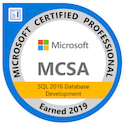

# Welcome to Mark's Portfolio

Here you will find examples to get a feel for his skills.  Examples may differ from a delivered product for security reasons or have been produced just for inclusion into this portfolio.  The provided examples and certifications are supplements to his resume.

### About Mark Meiners

Mark's current skill-set revolves around doing data analysis work using SQL and Tableau.  Mark has been using Microsoft SQL Server in various roles since 2005 when he first created an OLTP training database with a web front-end.  After this, Mark spent time supporting a SharePoint backend responsible for database and server maintenance.  Most recently, Mark was responsible for doing data analysis and reporting where he spent at least 50% of his time responding to ad hoc data requests.  While Mark spent most of his time working with SQL Server, in his previous position the data warehouse he would query was based on IBM's Db2. 

Currently, Mark Meiners is learning how to use the Python data stack.  His GitHub may have samples of Jupyter Notebooks or other WIP outside this portfolio.  Mark feels it will be a powerful tool to add to his current skill-set in the future.  

Mark Meiners has recently earned the MCSA certification: SQL 2016 Database Development.  You can view his certification badges at the following link: https://www.youracclaim.com/users/mark-meiners/badges

# Examples
### City of Phoenix Open Data Exploratory Viz
[Sample Tableau visualizations](PhoenixExamples) based on data found on the Phoenix Open Data Portal

### Prior Work Examples
1.  [Before and After](PriorWorkExamples/BeforeAndAfterReports): Report redesign example with approach explained
2.  [Database Diagram](PriorWorkExamples/DatabaseDiagrams): OLTP database design project 
3.  [SQL Code](PriorWorkExamples/SqlCode): Data is messy, here's how a missing field problem was solved